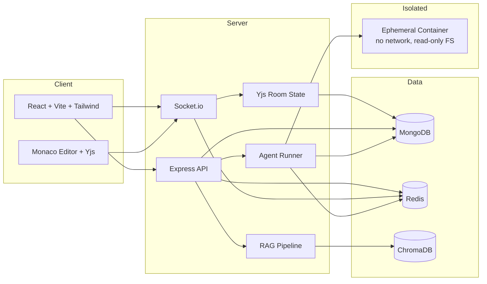

# CodeSync — Real-Time Collaborative Code Editor with AI Review and Sandboxed Execution

A collaborative code editor with CRDT-based real-time sync, version history, RAG-grounded AI review, and an isolated Docker sandbox that executes code and proves the AI's claims by running them.

## Architecture



## Features

### Collaboration
- Real-time CRDT editing with Yjs and awareness-driven cursors
- Presence, chat, and room invites
- Version history with publish, preview, and restore using Monaco DiffEditor
- Redis-backed scaling for Socket.io, rate limiting, and caching

### AI
- **AI Review** — RAG-grounded review with ChromaDB context, streamed over SSE
- **Run** — execute the editor buffer in an isolated container and get the real exit code, stdout and stderr back
- **Verify & Fix** — the model must name a defect, write a test that *fails* because of it, and produce a fix that makes the same test pass. If its test passes against your original code, the claim was imaginary and is discarded rather than shown

The distinction matters: a reviewer emits an opinion and nothing checks whether it is true. Verify & Fix makes every claim falsifiable by execution.

### Agent Runner (optional subsystem)
An event-triggered agent that writes code, runs it in the sandbox, reads its own stderr, and self-corrects across up to 3 attempts. Triggered by HMAC-signed webhook, an authenticated manual endpoint, or cron. Results, generated code per attempt, and downloadable artifacts are viewable at `/runs` with live SSE streaming.

Gated behind `AGENT_RUNNER_ENABLED` (default `false`). When disabled, `register()` returns before requiring anything, so its dependencies never enter the module cache.

## Sandbox Isolation

Every execution gets a fresh container, killed on a wall-clock deadline and removed unconditionally:

| Control | Setting |
| --- | --- |
| Network | `none` |
| Root filesystem | read-only |
| Workspace | tmpfs, `noexec,nosuid,nodev`, size-capped |
| Memory | 512m, with swap pinned equal so the cap cannot be escaped |
| CPU | 0.5 cores |
| Processes | 128 max |
| Capabilities | all dropped, `no-new-privileges`, uid 1000 |
| Wall clock | 30s, then SIGKILL |

Docker shares the host kernel and is not a hard boundary against hostile code. `SECURITY.md` states that plainly, names gVisor and Firecracker as the production path, and documents the two deliberate holes in the boundary (the artifacts bind mount and the Docker socket) rather than burying them.

## Tech Stack

| Layer | Technology |
| --- | --- |
| Backend | Node.js, Express, Socket.io |
| Frontend | React, Vite, Tailwind CSS |
| Editor | Monaco Editor + Yjs |
| Database | MongoDB (Mongoose ODM) |
| Cache/Pub-Sub | Redis (ioredis) |
| AI/RAG | LangChain.js, Google Gemini API, ChromaDB |
| Sandbox | Docker via dockerode |
| Job Queue | BullMQ (isolated Redis DB) |
| Testing | Jest, Supertest, React Testing Library, Playwright |
| Containers | Docker, Docker Compose |

## Prerequisites

- Docker Desktop
- Node.js 20+
- Google Gemini API key (aistudio.google.com)

## Quick Start

```bash
docker-compose up --build
```

- Client: http://localhost:3000
- API: http://localhost:3001
- Health check: http://localhost:3001/health

## Environment Variables

Create a `.env` file based on `.env.example`.

| Variable | Description |
| --- | --- |
| NODE_ENV | Environment name |
| PORT | API port |
| CLIENT_URL | Frontend base URL |
| MONGO_URI | MongoDB connection string |
| REDIS_URL | Redis connection string |
| REDIS_PREFIX | Redis key prefix |
| CACHE_TTL_SECONDS | Document metadata cache TTL |
| JWT_ACCESS_SECRET | Access token secret |
| JWT_REFRESH_SECRET | Refresh token secret |
| JWT_ACCESS_EXPIRES_IN | Access token TTL |
| JWT_REFRESH_EXPIRES_IN | Refresh token TTL |
| COOKIE_SECURE | Use secure cookies |
| COOKIE_DOMAIN | Cookie domain |
| COOKIE_SAMESITE | Cookie same-site value |
| RATE_LIMIT_REVIEWS_PER_HOUR | AI review limit per hour |
| RATE_LIMIT_API_WINDOW_SECONDS | API rate limit window |
| RATE_LIMIT_API_MAX | API max requests per window |
| GEMINI_API_KEY | Gemini API key |
| GEMINI_MODEL | Gemini chat model |
| GEMINI_EMBEDDING_MODEL | Gemini embedding model |
| CHROMA_URL | ChromaDB URL |
| RAG_DOCS_PATH | RAG documents directory |
| YJS_PERSIST_DEBOUNCE_MS | Yjs debounce persist interval |
| YJS_PERSIST_MAX_MS | Yjs max persist interval |
| YJS_ROOM_TTL_MS | Room cleanup TTL |
| AUTO_SAVE_LIMIT | Auto-save version cap |
| LOG_LEVEL | Logger level |
| VITE_API_URL | Frontend API base URL |
| VITE_SOCKET_URL | Frontend Socket.io URL |

The Agent Runner reads its own `AGENT_RUNNER_*` namespace, documented separately in `.env.agent-runner.example`. Its config is self-contained and does not inherit from the values above.

## API Documentation

### Auth

- `POST /api/auth/register`

Request:
```json
{
  "name": "Ada Lovelace",
  "email": "ada@example.com",
  "password": "password123"
}
```

Response:
```json
{
  "success": true,
  "data": {
    "user": { "id": "...", "name": "Ada Lovelace", "email": "ada@example.com" },
    "accessToken": "..."
  }
}
```

- `POST /api/auth/login`
- `POST /api/auth/refresh`

### Documents

- `POST /api/documents`
- `GET /api/documents`
- `GET /api/documents/:id`
- `PATCH /api/documents/:id`
- `DELETE /api/documents/:id`

### Versions

- `POST /api/documents/:id/versions`
- `GET /api/documents/:id/versions?page=1&limit=20`
- `GET /api/documents/:id/versions/:versionId`
- `POST /api/documents/:id/versions/:versionId/restore`
- `DELETE /api/documents/:id/versions/:versionId`

### AI Review

- `GET /api/review/stream?documentId=...` (SSE)
- `POST /api/review`
- `GET /api/review/history?documentId=...`

### Execution and Agent Runs

Available only when `AGENT_RUNNER_ENABLED=true`; otherwise the whole namespace 404s.

| Endpoint | Auth | Description |
| --- | --- | --- |
| `POST /api/runs/execute` | JWT | Run a code snippet in the sandbox. Returns exit code, stdout, stderr, duration |
| `POST /api/runs/verify-fix` | JWT | Prove-and-fix loop, streamed over SSE |
| `GET /api/runs/runtimes` | JWT | Which languages can actually be executed |
| `POST /api/runs` | JWT | Trigger an agent run manually |
| `GET /api/runs` | JWT | List runs |
| `GET /api/runs/tasks` | JWT | List available task definitions |
| `GET /api/runs/:id` | JWT | Run detail with per-attempt code and results |
| `GET /api/runs/:id/stream` | JWT | Live run events (SSE) |
| `GET /api/runs/:id/artifacts/:name` | JWT | Download a generated artifact |
| `POST /api/runs/trigger/:taskId` | HMAC | Webhook trigger, authorised by signature over the raw request bytes |

`POST /api/runs/execute` example:

```json
{ "code": "console.log(1 + 1)", "language": "javascript" }
```

```json
{
  "success": true,
  "data": { "exitCode": 0, "stdout": "2\n", "stderr": "", "durationMs": 1100, "timedOut": false }
}
```

JavaScript is the only executable runtime — the sandbox image carries no other toolchain. Other languages are refused with a reason rather than a generic 400.

## WebSocket Events

| Event | Direction | Payload |
| --- | --- | --- |
| `room:join` | client -> server | `{ documentId }` |
| `room:leave` | client -> server | `{ documentId }` |
| `presence:update` | server -> client | `{ documentId, users }` |
| `sync:full` | server -> client | `{ documentId, update, awareness }` |
| `sync:update` | both | `{ documentId, update }` |
| `awareness:update` | both | `{ documentId, update }` |
| `chat:message` | both | `{ documentId, message }` |
| `doc:restored` | server -> client | `{ label, user }` |

## Testing

Backend — 23 suites, 233 tests:
```bash
cd server
npm test
```

Frontend:
```bash
cd client
npm test
```

Browser end-to-end (Playwright):
```bash
npx playwright test
```

The backend suite passes with `AGENT_RUNNER_ENABLED` both `false` and `true`. Sandbox tests use a real `docker-modem` so the actual 8-byte stream demuxing is exercised rather than a stand-in.

## Architecture Decisions

- **Yjs over OT**: conflict-free merges with offline edits and low-latency sync.
- **Monaco over CodeMirror**: VS Code-grade editing, diff, and language tooling.
- **Redis adapter**: cross-instance Socket.io broadcast and room presence tracking.
- **SSE for AI streaming**: simpler client handling and better backpressure than WebSockets. Delivered via `fetch` + `body.getReader()` rather than `EventSource`, which cannot send an `Authorization` header.
- **Run events over Redis pub/sub, not a local emitter**: with multiple replicas, a browser's SSE connection lands on a different instance than the one executing the run. A local emitter would work on one replica and silently show nothing on the others.
- **Pinned Gemini model, no fallback chain**: a chain can silently escalate to another tier on 429 and drain the daily quota, and a budget counting calls cannot detect it. On 429 the runner backs off against the same model; on 404 it fails loudly rather than substituting.
- **Exit code as the source of truth**: a model can claim anything in prose but cannot make a failing assertion pass. Every Verify & Fix verdict is decided by a process exit status, not by what the model said about its own work.
- **Agent Runner isolated behind a flag**: self-contained under `server/src/agent-runner/`, with a small number of marker-wrapped touch points in shared files. `REMOVAL.md` documents removing it completely.

## Production Deployment

Optimized for local Docker Compose. For production:

- ECS/Fargate for containers
- ElastiCache for Redis
- DocumentDB for MongoDB
- ALB with sticky sessions for WebSocket support
- gVisor or Firecracker for the execution sandbox, and a socket proxy in place of the raw Docker socket mount (see `SECURITY.md`)

## Further Reading

| Document | Contents |
| --- | --- |
| `AGENT_RUNNER.md` | Agent Runner architecture and run instructions |
| `SECURITY.md` | Sandbox threat model and the deliberate gaps in it |
| `REMOVAL.md` | How to remove the Agent Runner completely |
| `VERIFICATION.md` | Live verification results, including what failed and what is still unverified |

## Local RAG Embedding

```bash
cd server
npm run embed:rag
```
