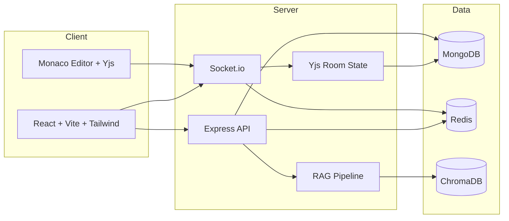

# Real-Time Collaborative Code Editor with AI-Assisted Code Review

A production-grade collaborative code editor with real-time CRDT sync, version history, and AI code review powered by RAG.

## Architecture



## Features

- Real-time CRDT editing with Yjs and awareness-driven cursors
- Presence, chat, and room invites
- Version history with publish, preview, and restore using Monaco DiffEditor
- AI code review with RAG context and streaming SSE responses
- Redis-backed scaling for Socket.io, rate limiting, and caching
- Production-grade error handling, logging, and graceful shutdown

## Tech Stack

| Layer | Technology |
| --- | --- |
| Backend | Node.js, Express, Socket.io |
| Frontend | React, Vite, Tailwind CSS |
| Editor | Monaco Editor + Yjs |
| Database | MongoDB (Mongoose ODM) |
| Cache/Pub-Sub | Redis (ioredis) |
| AI/RAG | LangChain.js, Google Gemini API, ChromaDB |
| Testing | Jest, Supertest, React Testing Library |
| Containers | Docker, Docker Compose |

## Prerequisites

- Docker Desktop
- Node.js 20+
- Google Gemini API key (aistudio.google.com)

## Quick Start

```bash
docker-compose up --build
```

- Client: http://localhost:3000
- API: http://localhost:3001
- Health check: http://localhost:3001/health

## Environment Variables

Create a `.env` file based on `.env.example`.

| Variable | Description |
| --- | --- |
| NODE_ENV | Environment name |
| PORT | API port |
| CLIENT_URL | Frontend base URL |
| MONGO_URI | MongoDB connection string |
| REDIS_URL | Redis connection string |
| REDIS_PREFIX | Redis key prefix |
| CACHE_TTL_SECONDS | Document metadata cache TTL |
| JWT_ACCESS_SECRET | Access token secret |
| JWT_REFRESH_SECRET | Refresh token secret |
| JWT_ACCESS_EXPIRES_IN | Access token TTL |
| JWT_REFRESH_EXPIRES_IN | Refresh token TTL |
| COOKIE_SECURE | Use secure cookies |
| COOKIE_DOMAIN | Cookie domain |
| COOKIE_SAMESITE | Cookie same-site value |
| RATE_LIMIT_REVIEWS_PER_HOUR | AI review limit per hour |
| RATE_LIMIT_API_WINDOW_SECONDS | API rate limit window |
| RATE_LIMIT_API_MAX | API max requests per window |
| GEMINI_API_KEY | Gemini API key |
| GEMINI_MODEL | Gemini chat model |
| GEMINI_EMBEDDING_MODEL | Gemini embedding model |
| CHROMA_URL | ChromaDB URL |
| RAG_DOCS_PATH | RAG documents directory |
| YJS_PERSIST_DEBOUNCE_MS | Yjs debounce persist interval |
| YJS_PERSIST_MAX_MS | Yjs max persist interval |
| YJS_ROOM_TTL_MS | Room cleanup TTL |
| AUTO_SAVE_LIMIT | Auto-save version cap |
| LOG_LEVEL | Logger level |
| VITE_API_URL | Frontend API base URL |
| VITE_SOCKET_URL | Frontend Socket.io URL |

## API Documentation

### Auth

- `POST /api/auth/register`

Request:
```json
{
  "name": "Ada Lovelace",
  "email": "ada@example.com",
  "password": "password123"
}
```

Response:
```json
{
  "success": true,
  "data": {
    "user": { "id": "...", "name": "Ada Lovelace", "email": "ada@example.com" },
    "accessToken": "..."
  }
}
```

- `POST /api/auth/login`
- `POST /api/auth/refresh`

### Documents

- `POST /api/documents`
- `GET /api/documents`
- `GET /api/documents/:id`
- `PATCH /api/documents/:id`
- `DELETE /api/documents/:id`

### Versions

- `POST /api/documents/:id/versions`
- `GET /api/documents/:id/versions?page=1&limit=20`
- `GET /api/documents/:id/versions/:versionId`
- `POST /api/documents/:id/versions/:versionId/restore`
- `DELETE /api/documents/:id/versions/:versionId`

### AI Review

- `GET /api/review/stream?documentId=...` (SSE)
- `POST /api/review`
- `GET /api/review/history?documentId=...`

## WebSocket Events

| Event | Direction | Payload |
| --- | --- | --- |
| `room:join` | client -> server | `{ documentId }` |
| `room:leave` | client -> server | `{ documentId }` |
| `presence:update` | server -> client | `{ documentId, users }` |
| `sync:full` | server -> client | `{ documentId, update, awareness }` |
| `sync:update` | both | `{ documentId, update }` |
| `awareness:update` | both | `{ documentId, update }` |
| `chat:message` | both | `{ documentId, message }` |
| `doc:restored` | server -> client | `{ label, user }` |

## Testing

Backend:
```bash
cd server
npm test
```

Frontend:
```bash
cd client
npm test
```

## Architecture Decisions

- **Yjs over OT**: conflict-free merges with offline edits and low-latency sync.
- **Monaco over CodeMirror**: VS Code-grade editing, diff, and language tooling.
- **Redis adapter**: cross-instance Socket.io broadcast and room presence tracking.
- **SSE for AI streaming**: simpler client handling and better backpressure than WebSockets.
- **Gemini free tier**: no paid API dependency while keeping high-quality responses.

## Production Deployment

This project is optimized for local Docker Compose. For production you can deploy to AWS using:

- ECS/Fargate for containers
- ElastiCache for Redis
- DocumentDB for MongoDB
- ALB with sticky sessions for WebSocket support

## Screenshots

Add UI screenshots here.

## Local RAG Embedding

```bash
cd server
npm run embed:rag
```
